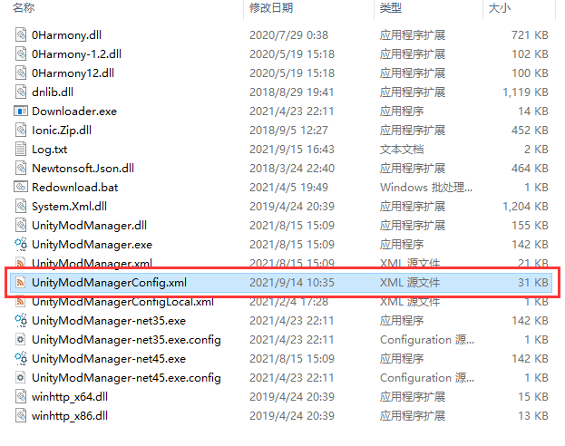
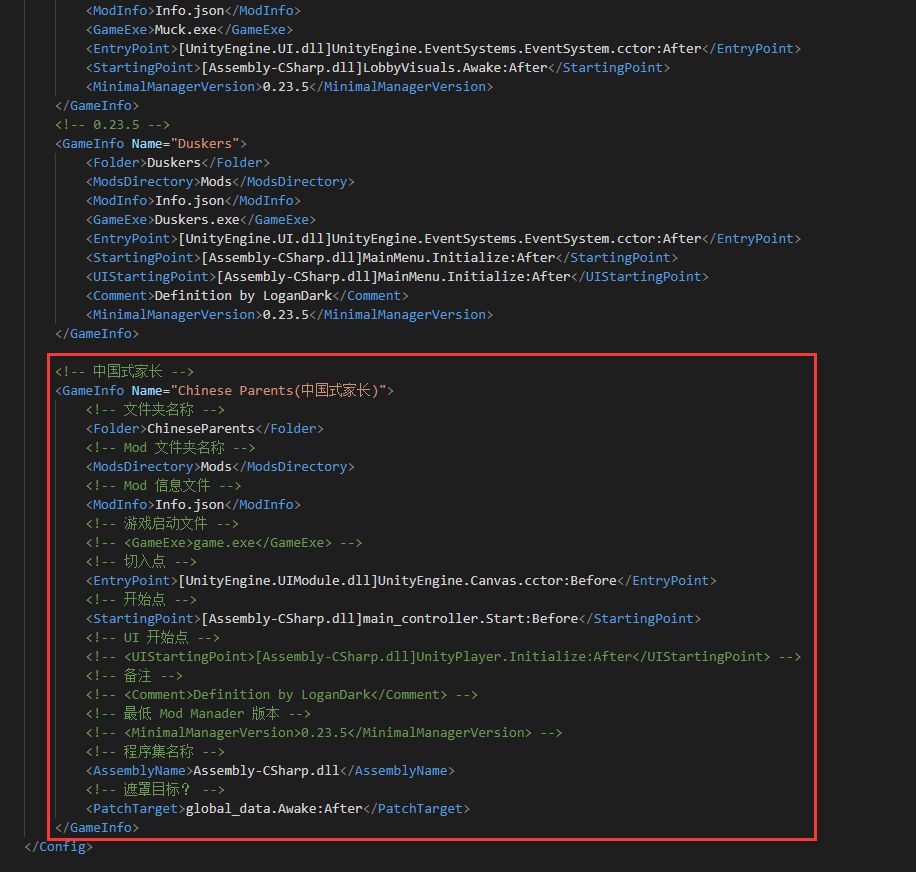

# 下载 Unity Mod Manager 与导入配置
1. 进入 [Unity Mod Manager 官网](https://www.nexusmods.com/site/mods/21/?tab=description)（可能官方会改变链接，如果链接失效请自行搜索）
2. 下载并解压

进入官网后点击 FILES 进入下载列表。

在下载列表中选一个下载并解压即可。
3. 导入对中国式家长的兼容配置

在解压后文件夹中找到 UnityModManagerConfig.xml

打开文件，添加配置内容，注意层级，不是加在文件最后面，是加在 &#60;Config&#62;&#60;/Config&#62; 里面。  
添加的内容：
```
<!-- 中国式家长 -->
	<GameInfo Name="Chinese Parents(中国式家长)">
		<!-- 文件夹名称 -->
		<Folder>ChineseParents</Folder>
		<!-- Mod 文件夹名称 -->
		<ModsDirectory>Mods</ModsDirectory>
		<!-- Mod 信息文件 -->
		<ModInfo>Info.json</ModInfo>
		<!-- 游戏启动文件 -->
		<!-- <GameExe>game.exe</GameExe> -->
		<!-- 切入点 -->
		<EntryPoint>[UnityEngine.UIModule.dll]UnityEngine.Canvas.cctor:Before</EntryPoint>
		<!-- 开始点 -->
		<StartingPoint>[Assembly-CSharp.dll]main_controller.Start:Before</StartingPoint>
		<!-- UI 开始点 -->
		<!-- <UIStartingPoint>[Assembly-CSharp.dll]UnityPlayer.Initialize:After</UIStartingPoint> -->
		<!-- 备注 -->
		<!-- <Comment>Definition by LoganDark</Comment> -->
		<!-- 最低 Mod Manader 版本 -->
		<!-- <MinimalManagerVersion>0.23.5</MinimalManagerVersion> -->
		<!-- 程序集名称 -->
		<AssemblyName>Assembly-CSharp.dll</AssemblyName>
		<!-- 遮罩目标？ -->
		<PatchTarget>global_data.Awake:After</PatchTarget>
	</GameInfo>
```
