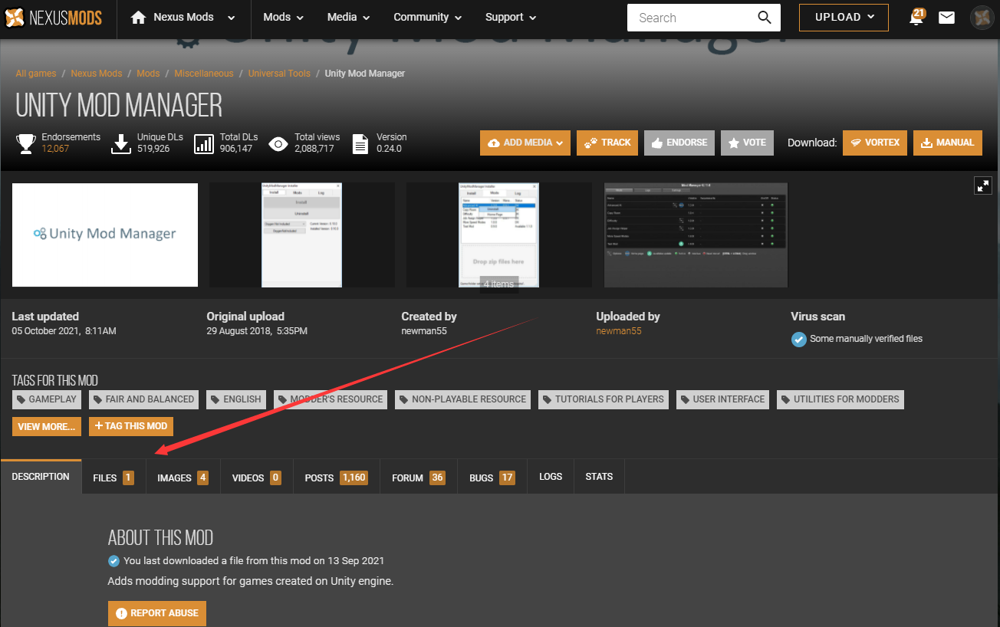
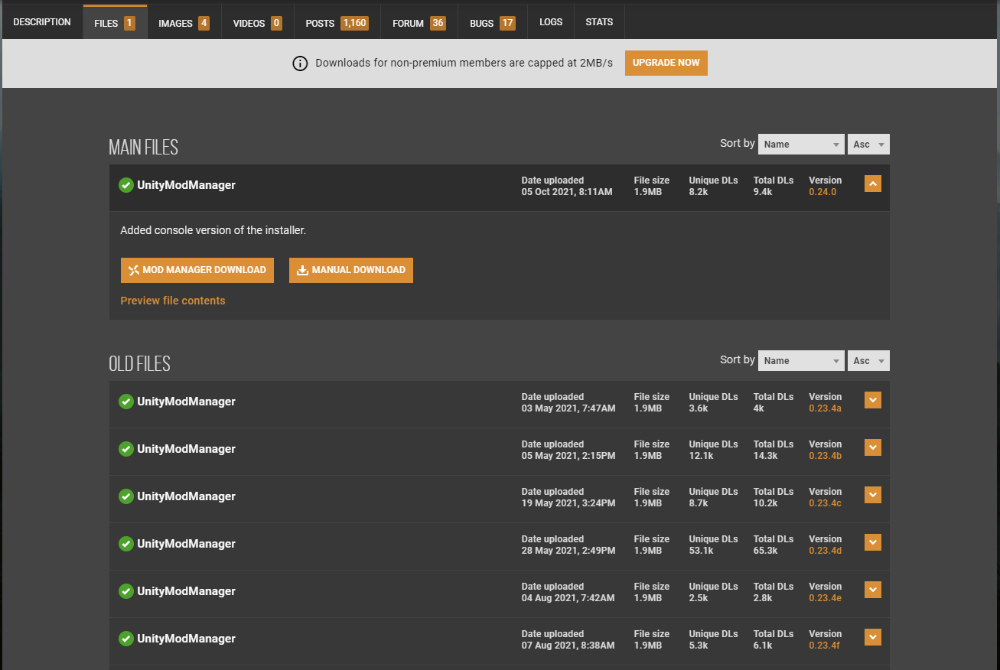

# 下载 Unity Mod Manager 与导入配置
1. 进入 [Unity Mod Manager 官网](https://www.nexusmods.com/site/mods/21/?tab=description)（可能官方会改变链接，如果链接失效请自行搜索）
2. 下载并解压

进入官网后点击 FILES 进入下载列表。

在下载列表中选一个下载并解压即可。
5. 导入对中国式家长的兼容配置
